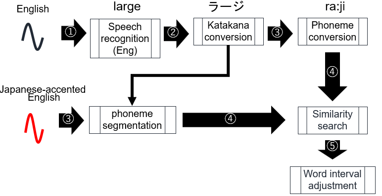
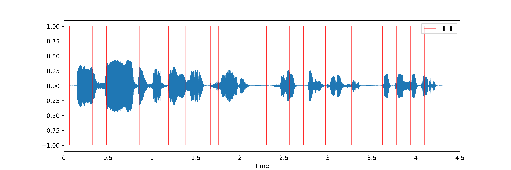
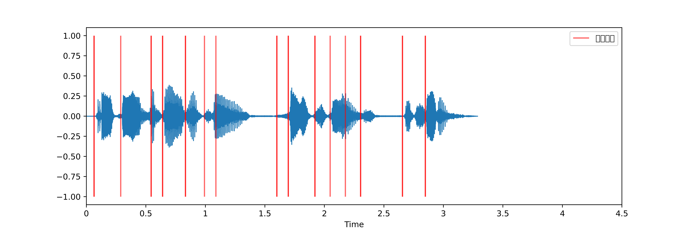
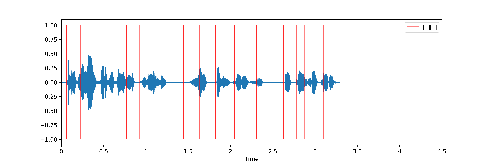

# jaeeadjuster
A tool to adjust durations of words between Japanese-accented English & English

The following are the overall processes.

1 :it conduct English speech recognition using stable-whisper for English

2: it converte from English to Japanese katakana using a Katakana-English dictionary or a rule

3: it conduct phoneme segmentation using Julius & transcripts from English for Japanese-accented English 

4: it search similar points of words between Japanese-accented English & English

5: it adjust start points of words by accelerating audio

As a result, it made audio files of Japanease-accented English which have identical durations of words, ideally  

# sample reesult
Showing onset of audio
Japanese-accented English

American English

Adjusted Japanse-accented English

# Lisence
GPLv2
